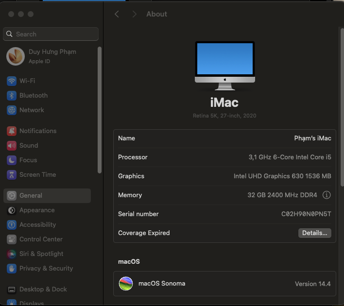
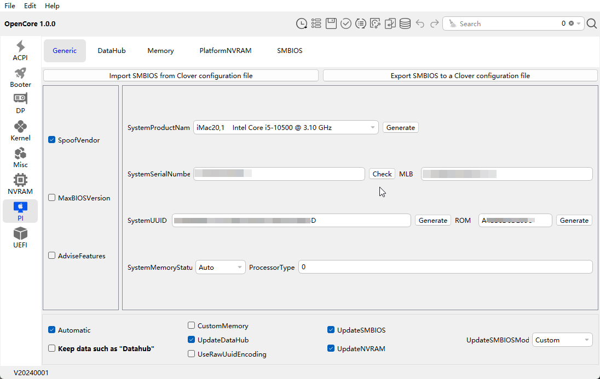

# EFI Hackintosh Sonoma 14.4 - Opencore 1.0 for Dell Optiplex 7080 MT

## Introdution

You need [**generate a new SMIBIOS**](https://github.com/corpnewt/GenSMBIOS) before login to your iCloud account.
> easy way with [OCAT](https://github.com/ic005k/OCAuxiliaryTools/blob/master/READMe.md)

##

## Hardware Specs

- **Desktop Computer**: [Dell OptiPlex 7080 Tower](https://www.dell.com/en-us/work/shop/desktops-all-in-one-pcs/optiplex-7080-tower-and-small-form-factor/spd/optiplex-7080-desktop)
- **CPU**:  [Intel® Core™ i5-10500](https://ark.intel.com/content/www/us/en/ark/products/199316/intel-core-i710700-processor-16m-cache-up-to-4-80-ghz.html)
- **iGPU**: Intel® UHD Graphics 630
- **RAM**: 64GB DDR4 2933 Daul Channel
- **SSD1**: T-FORCE Z440 NVMe Gen4 SSD 1T
- **SSD2**: Dell NVMe SSSTC 256GB
- **HDD1**: WDC 2T
- **HDD2**: ST1000DM010 1T
- **LAN**: Intel I219LM11
- **Wi-Fi & Bluetooth**: intel wifi 6 ax201

##

## Working

- CPU Turbo Boost & SpeedStep
- Front panel headphone out / Back panel lineout
- USB Ports
- LAN & Wireless & Network
- Sleep & Wakeup
- Airdrop / Airplay /  Handoff
- Dual boot with window on other driver

##

## Not working

- Shutdown (after shutdown, case still runnng)

##

## UEFI Settings

- System Configuration → Serial Port: ***Disabled***
- System Configuration → SATA Operation: ***AHCI***
- Video → Multi Display: ***Enable Multi-Display***
- Video → Primary Display: ***Auto***
- Security → PTT Security: ***uncheck***
- Secure Boot → Secure Boot Enable: ***uncheck***
- Intel® Software Guard Extensions™ → Intel® SGX™ Enable: ***uncheck***
- Virtualization Support → VT for Direct I/O: ***check***

##

## Modify DVMT & CFG_lock settings

- BIOS/UEFI editor [ru.efi](https://github.com/JamesAmiTw/ru-uefi)
- Disable CFG lock: set ***003E*** to ***0x00*** under ***CPUSetup***
- 64M Pre-Allocated DVMT: set ***00F5*** to ***0x02*** under ***SASetup***

